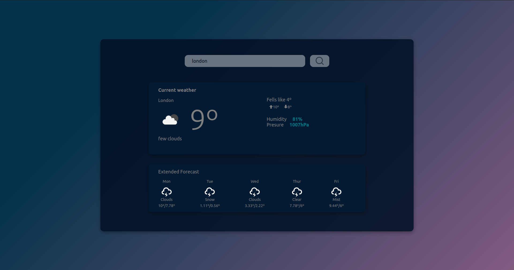

<h1 align="center">Weather App :cloud:</h1>

Web App que consome uma api de previsão do tempo

[Clique aqui para acessar a API](https://rapidapi.com/community/api/open-weather-map)



### :nut_and_bolt: Tecnologias

Esse projeto foi desenvolvido com as seguintes técnologias:

- [TypeScript][typescript]
- [React][reactjs]

[nodejs]: https://nodejs.org/
[typescript]: https://www.typescriptlang.org/
[expo]: https://expo.io/
[reactjs]: https://reactjs.org
[rn]: https://facebook.github.io/react-native/
[yarn]: https://yarnpkg.com/

### :tractor: Como rodar o projeto?

Você vai precisar ter docker instalado na sua máquina para rodar o banco de dados PostgreSQL ou instalar diretamente na sua máquina.

```bash
# Clone o repositório
git clone https://github.com/defauth98/weather-app.git weather-app

# Entre no diretório do projeto
cd weather-app

# Instale as dependencias
yarn

# Configure o seu api em /src/services/api.ts e rode o app
yarn start
```

### Autor

👤 **Daniel Ribeiro**

- Twitter: [@defauth8](https://twitter.com/defauth8)
- Github: [@defauth98](https://github.com/defauth98)
- LinkedIn: [@daniel-ribeiro-397604164](https://linkedin.com/in/daniel-ribeiro-397604164)